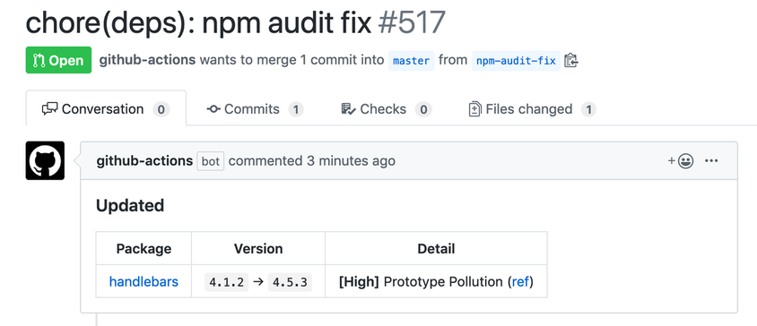

[](https://github.com/ybiquitous/npm-audit-fix-action/actions)

# `npm audit fix` Action

This action runs [`npm audit fix`](https://docs.npmjs.com/cli/audit) and creates a pull request.

## Usage

For example, you can add this action by creating [`.github/workflows/npm-audit-fix.yml`](.github/workflows/npm-audit-fix.yml):

```yaml
name: npm audit fix

on:
  schedule:
    - cron: "0 0 * * *"
  workflow_dispatch:

jobs:
  npm-audit-fix:
    runs-on: ubuntu-latest
    steps:
      - uses: actions/checkout@v2
      - uses: ybiquitous/npm-audit-fix-action@v3
```

See also [`action.yml`](action.yml) about the available options.

### Using a personal access token

If you want to run your CI with pull requests created by this action, you may need to set your [personal access token](https://docs.github.com/en/github/authenticating-to-github/creating-a-personal-access-token) instead of the GitHub's default token:

For example:

```yaml
with:
  github_token: ${{ secrets.PERSONAL_ACCESS_TOKEN }}
```

The reason is that the default token does not have enough permissions to trigger CI.
See also the [GitHub document](https://docs.github.com/en/actions/configuring-and-managing-workflows/authenticating-with-the-github_token#permissions-for-the-github_token) about the token permissions.

## Screenshot



## License

[MIT](LICENSE) © Masafumi Koba
