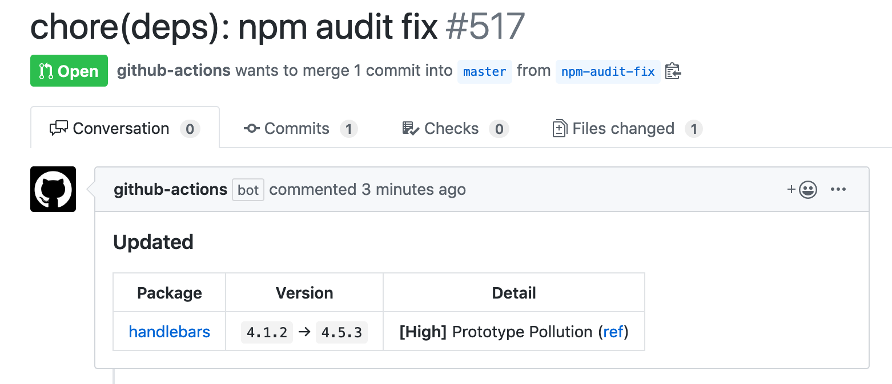

<p align="center">
  <a href="https://github.com/ybiquitous/npm-audit-fix-action/actions"></a>
</p>

# `npm audit fix` Action

This action runs [`npm audit fix`](https://docs.npmjs.com/cli/audit) and creates a pull request.

## Usage

For example, you can add a new workflow via `.github/workflows/npm-audit-fix.yml`

```yaml
name: npm audit fix

on:
  schedule:
    - cron: 0 0 * * * # Runs at 00:00 UTC every day

jobs:
  npm-audit-fix:
    runs-on: ubuntu-latest
    steps:
      - uses: ybiquitous/npm-audit-fix-action@v1
        with:
          github_token: ${{ secrets.GITHUB_TOKEN }}
          # branch: "npm-audit-fix"
          # default_branch: "master"
          # commit_title: "chore(deps): npm audit fix"
```

## Demo



## License

[MIT](LICENSE) © Masafumi Koba
