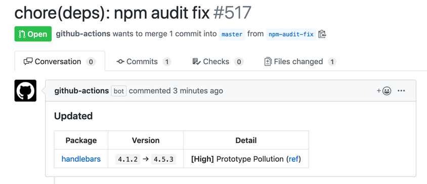

[](https://github.com/ybiquitous/npm-audit-fix-action/actions/workflows/test.yml)

# `npm audit fix` Action

This GitHub Action runs [`npm audit fix`](https://docs.npmjs.com/cli/audit) and creates a pull request.

## Usage

Create `.github/workflows/npm-audit-fix.yml` and put the following content into it:

```yaml
name: npm audit fix

on:
  schedule:
    - cron: "0 0 * * *" # every day at 00:00
  workflow_dispatch:

jobs:
  npm-audit-fix:
    runs-on: ubuntu-latest
    permissions:
      contents: write
      pull-requests: write
    steps:
      - name: Check out
        uses: actions/checkout@v7
      - name: Run npm audit fix
        uses: ybiquitous/npm-audit-fix-action@v8
```

### Inputs

| Name             | Description                                   | Default                              |
| ---------------- | --------------------------------------------- | ------------------------------------ |
| `github_token`   | GitHub token.                                 | `${{ github.token }}`                |
| `branch`         | Created branch.                               | `npm-audit-fix-action/fix`           |
| `default_branch` | Default branch.                               | Auto-detected.                       |
| `commit_title`   | Commit message and pull request title.        | `build(deps): npm audit fix`         |
| `labels`         | Labels for pull request (comma-separated).    | `dependencies, javascript, security` |
| `assignees`      | Assignees for pull request (comma-separated). | n/a                                  |
| `npm_args`       | Arguments for the `npm` command.              | n/a                                  |
| `path`           | Path to the project root directory.           | `.`                                  |

### Outputs

| Name               | Description                      |
| ------------------ | -------------------------------- |
| `pull_request_url` | URL of the created pull request. |
| `branch_name`      | Name of the created branch.      |

For more details, see [`action.yml`](action.yml).

## Screenshot



## License

[MIT](LICENSE) © Masafumi Koba
